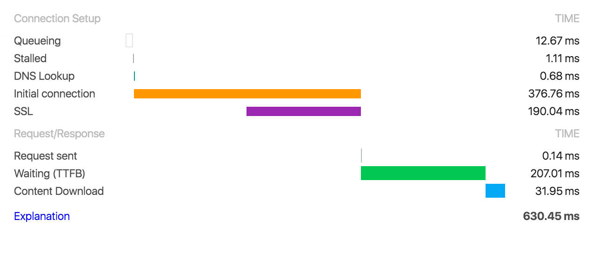
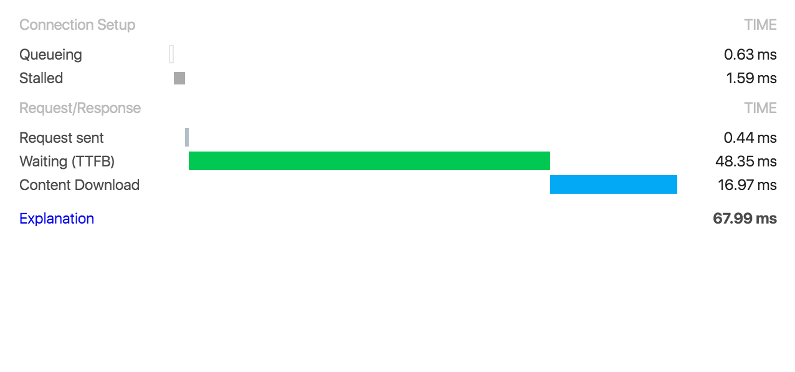

---

title: Tune HTTPS and HTTP/2 for low latency
name: tune-https-and-http-2-for-low-latency
author: sebastianmisch
tldr:
  If you just migrated to HTTPS or even HTTP/2 you may be disappointed
  of your website's performance. Let's tune it to be blazing fast!
layout: article

---

OK, you'v done it! You just migrated to HTTPS or even HTTP/2.
And you are disappointed of your website's performance.
Let's tune it to be blazing fast!

<div class="box box--internal-link">
  <span>
    Not yet migrated to HTTP/2? This is how to <a href="/2015/12/24/lets-encrypt-to-support-http-2-on-nginx" >set up
    HTTP/2 with nginx and let's encrypt</a>.
  </span>
</div>

## Why is HTTPS slow?
HTTPS and HTTP/2 use SSL/TLS for encrypted connections.
A SSL connection is done in several steps:

- Identification and Authentication of communication parties
- Key exchange between browser and server
- Session key generation
- Encryption using the latter key

Imagine these complex steps take some time and have to be done before your
server can send the first byte. This is called the SSL-Handshake and causes
some latency if your SSL setup is not tuned.

In a default HTTPS setup you just told your server to use your SSL-certificates
and your HTTPS is up and running.



As one can see above there is a major latency of ~400ms for SSL connection
setup and another 200ms before sending the first byte (this is called TTFB:
_time to first byte_).

This means that your browser waited about 600ms to get the first byte of your
website.


## Getting latency down from 600ms to 50ms
There are some great resources on SSL out there, basically the HTTPS article
by <a href="https://twitter.com/bjornjohansen" target="bjornjohansen">@bjornjohansen</a> and the
<a href="http://nginx.org/en/docs/http/configuring_https_servers.html"
target="nginxdocumentation">nginx documentation</a>.

Assuming you run nginx, HTTP/2 with let's-encrypt certifcates the following
instructions can greatly improve your server's latency.

### Caching sessions
As discussed before the initial SSL-handshake takes some time. So let's just
cache it!
```
ssl_session_cache shared:SSL:20m;
ssl_session_timeout 60m;
```
This will use the cached connection handshakes for about 60 minutes per
visitor. Effect? The second connection to your server, i.e.
when a visitor requests another page of your site, will be the cached one.


### Switch to TLS protocols
A default SSL setup often includes SSLv2 and SSLv3 protocols. SSL protocols
are superseeded by TLS, which is more secure. So just drop SSL support.
```
ssl_protocols TLSv1 TLSv1.1 TLSv1.2;
```


### Setup ciphers
The cipher suites are the encryption algorithms your server will support.
There is a large list of them. Let's just use the securest and fastest.
```
ssl_prefer_server_ciphers on;
ssl_ciphers ECDH+AESGCM:ECDH+AES256:ECDH+AES128:DH+3DES:!ADH:!AECDH:!MD5;
```
Newer CPUs do have hardware acceleration for AES. This boosts encryption
performance to the max. To see if your server does support it, just have
a look into `/proc/cpuinfo`.
```bash
$ grep aes /proc/cpuinfo && echo AES supported || echo no AES support
AES supported
```


### Setup Diffie-Hellman handshake
The SSL handshake is done via a Diffie-Hellman cipher. Using and setting
up a custom one improves performance and security.
```
$ openssl dhparam 2048 -out /etc/nginx/cert/dhe.pem
```

```
ssl_dhparam /etc/nginx/cert/dhe.pem;
```


### Setup stapling via Online Certificate Status Protocol
When connecting to a HTTPS server the browser has to verify the validity of
the server's certificate. This is done online by asking a CA's (certificate authority) _Certificate Revocation List_.

Stapling allows to serve a cached OCSP response from your CA, - which saves
on DNS and roundtrips.

To get this done (for let's-encrypt) download root- and intermediate
certificates from your CA and concat them into `/etc/nginx/cert/trustchain.crt`.

```bash
$ curl https://letsencrypt.org/certs/isrgrootx1.pem.txt > /etc/nginx/cert/trustchain.crt
$ curl https://letsencrypt.org/certs/lets-encrypt-x1-cross-signed.pem.txt >> /etc/nginx/cert/trustchain.crt
$ curl https://letsencrypt.org/certs/lets-encrypt-x2-cross-signed.pem.txt >> /etc/nginx/cert/trustchain.crt

```
Now enable stapling.
```
ssl_stapling on;
ssl_stapling_verify on;
ssl_trusted_certificate /etc/nginx/cert/trustchain.crt;
resolver 8.8.8.8 8.8.4.4;
```

### All tweaks in
```
server {
  listen 443 ssl http2;
  ssl on;
  ssl_certificate /etc/letsencrypt/live/<your-domain.tld>/fullchain.pem;
  ssl_certificate_key /etc/letsencrypt/live/<your-domain.tld>/privkey.pem;

  ssl_session_cache shared:SSL:20m;
  ssl_session_timeout 60m;

  ssl_prefer_server_ciphers on;
  ssl_ciphers ECDH+AESGCM:ECDH+AES256:ECDH+AES128:DH+3DES:!ADH:!AECDH:!MD5;

  ssl_dhparam /etc/nginx/cert/dhe.pem;

  ssl_protocols TLSv1 TLSv1.1 TLSv1.2;

  ssl_stapling on;
  ssl_stapling_verify on;
  ssl_trusted_certificate /etc/nginx/cert/trustchain.crt;
  resolver 8.8.8.8 8.8.4.4;

  add_header Strict-Transport-Security "max-age=31536000" always;

  root /srv/www/<your-domain.tld>/htdocs;
  index index.html;

  server_name <your-domain.tld> *.<your-domain.tld>;

  location / {
    expires 1d;
  }
}
```


### Result
So that was kind of tricky at some points. Let's restart nginx and see how
it performs:



Hell ya! Our *latency went down from 600ms to 50ms*. And even the content
downloading improved by ~50%.
