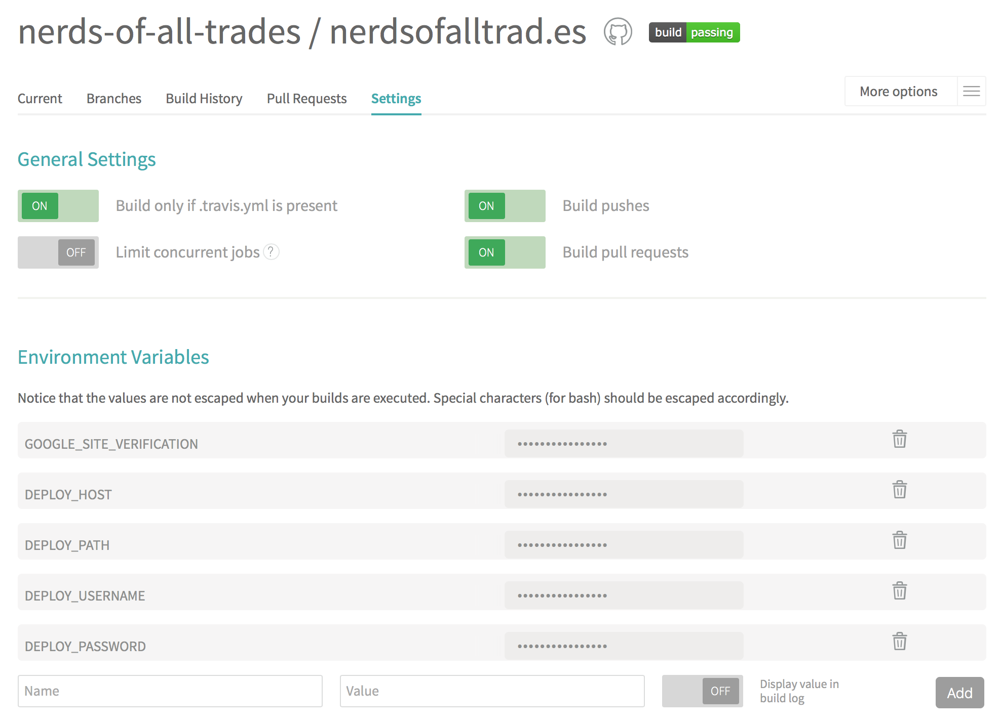

---

title: Auto-deploying to custom VPS using Travis CI
name: auto-deploying-to-custom-vps-using-travis-ci
author: sebastianmisch
tldr:
  It's time to bring Continuous Delivery to your Github project.
  This is a small tutorial about implementing auto-deployments to custom
  VPS using Travis CI.
layout: article

---

It's time to bring _Continuous Delivery_ to your Github project.
This is a small tutorial about implementing auto-deployments to custom
VPS (virtual private server) using Travis CI &mdash; without sacrificing
security and control.

## Create deployment user on your VPS
To deploy to your custom VPS we are creating a new deployment user:
```bash
$ sudo useradd -d /srv/www/mydomain.tld -m travis-deployment
$ sudo passwd travis-deployment
Password: 1LoveC@ts
```

Try to login as your new deployment user and create a `htdocs`-directory:
```bash
$ ssh travis-deployment@<my-vps-host>
Password: 1LoveC@ts
$ mkdir htdocs
$ logout
```

Now it's time to think about security. Every new user is a new risk. Please
choose a much stronger password and consider _chrooting_ like discussed below.

<div class="box box--external-link">
  <span>
    Improve security and limit the deployment user to
    <a href="http://serverfault.com/questions/354615/allow-sftp-but-disallow-ssh"
      target="sftponly">sftp-only using a _chroot_ environment</a>.
  </span>
</div>

## Install grunt-ssh
_grunt-ssh_ is a great plugin that wraps your SSH/ SFTP needs into a beautiful
configuration file.

Add it to your project:
```bash
$ npm i grunt-ssh --save-dev
```

The plugin comes with two tasks from which we register the `sftp`-task:
```javascript
sftp: {
  deploy: {
    files: {
      './': ['dist/.*', 'dist/**']
    },
    options: {
      host: process.env.DEPLOY_HOST,
      path: process.env.DEPLOY_PATH,
      username: process.env.DEPLOY_USERNAME,
      password: process.env.DEPLOY_PASSWORD,
      showProgress: true,
      srcBasePath: 'dist',
      createDirectories: true
    }
  }
}
```
BTW `dist` is the folder that is being deployed. Change it to where your
built assets live.

<div class="box box--external-link">
  <span>
    There is a lot more you can do with
    <a href="https://www.npmjs.com/package/grunt-ssh"
      target="gruntssh">grunt-ssh</a>.
    Despite from just copying assets _grunt-ssh_ allows you to remote-execute
    shell commands like restarting your application server etc...
  </span>
</div>

Now it's time to test how far we have come. Temporarily set up `DEPLOY_*`
environment variables to sandbox-test our first deployment.

```bash
$ export DEPLOY_HOST=<your-vps-ip>
$ export DEPLOY_PATH=/srv/www/mydomain.tld/htdocs
$ export DEPLOY_USERNAME=travis-deployment
$ export DEPLOY_PASSWORD=1LoveC@ts
$ grunt sftp:deploy
Running "sftp:deploy" (sftp) task
index.html [====================] 100% of 2KB
app.js     [====================] 100% of 701B
app.css    [====================] 100% of 230B
Created 0 directories, copied 3 files
```
Check. Your assets were copied to `<your-vps-ip>:/srv/www/mydomain.tld/htdocs`.

## Integrate deployment with npm
Add a deployment script shorthand to your `package.json`:
```json
"scripts": {
  "test": "your test scripts...",
  "deploy": "./node_modules/.bin/grunt sftp:deploy"
}
```

... and test it (still having the DEPLOY_* environment variables set):
```bash
$ npm run deploy
Running "sftp:deploy" (sftp) task
index.html [====================] 100% of 2KB
app.js     [====================] 100% of 701B
app.css    [====================] 100% of 230B
Created 0 directories, copied 3 files
```
Check.

## Tell Travis CI to deploy for you
Travis CI uses the `.travis.yml` in your project. I assume you already have one
because you searched for this article 😹.

After your tests pass Travis CI looks for an `after_success`-section in your
config. Just add the following to the end of your `.travis.yml`:
```
after_success:
  if [ "$TRAVIS_BRANCH" == "master" ] ; then
    if [ "x$DEPLOY_HOST$DEPLOY_PATH$DEPLOY_USER$DEPLOY_PASSWORD" != "x" ] ; then
      npm run deploy ;
    else
      echo "Deployment missing environment variables $DEPLOY_(HOST,PATH,USERNAME,PASSWORD)." ;
    fi
  else
    echo "Deployment omitted." ;
  fi
```
What does it do?
- After tests passed...
- ... and if on master branch
- ... and if DEPLOY_* environment variables are set
- ... then deploy
- ... else log a message and don't deploy


## Set up Travis CI
No one should have sensitive data like usernames and passwords stored in code,
nor in public repositories!
So we just add environment variables to your Travis CI project:
```
DEPLOY_HOST     = <your-vps-ip>
DEPLOY_PATH     = /srv/www/mydomain.tld/htdocs
DEPLOY_USERNAME = travis-deployment
DEPLOY_PASSWORD = 1LoveC@ts
```
Double-check to leave the _display value in build log_-switch unchecked!



## Commit, push and auto-deploy
Challenge completed! Now commit everything and push it to your repository:
```
$ git add -A
$ git commit . -m 'Add auto-deploying'
$ git push
```

<div class="box box--external-link">
  <span>
    Open your project's <a href="https://travis-ci.org"
      target="travisci">current Travis CI build</a>
    and let the magic happen 🍺
  </span>
</div>
